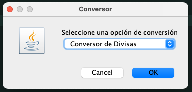
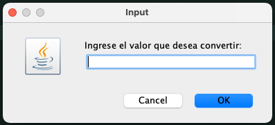
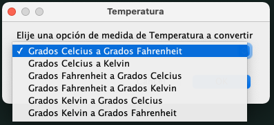
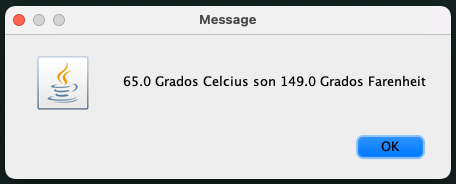
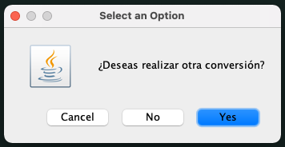

# Multi Conversor Desafío Alura

En este proyecto desarrollé un conversor de unidades multifuncional, es parte de los Challenge de Oracle Next Education.

Inicialmente, se solicitaba poder convertir divisas internacionales a la moneda nacional de cada alumno e instaban a subir el desafío,
por lo cual desarrollé una un conversor multifuncional, donde fueron implementadas en esta versión además de la conversión de divisas extranjera,
la conversión de unidades de temperatura así como de distancia, con una interfaz amigable e intuitiva.

## Funciones:

### Conversión de Divisas:

* Pesos Chilenos
* Dólar Estadounidense
* Euros
* Libras Esterlinas
* Yen
* Won Sur Coreano

### Conversión de Temperaturas:

* Celsius [°C]
* Kelvin [°K]
* Fahrenheit [°F]

### Conversión

* Pulgadas [in]
* Pie [ft]
* Millas [mil]
* Yardas [yd]
* Kilómetros [km]
* Metros [m]
* Centímetros [cm]

