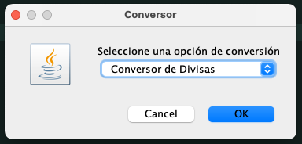
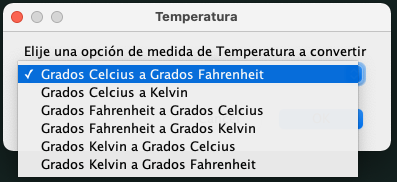
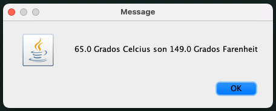
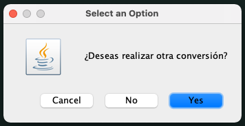

# Multi Conversor Desafio Alura

En este proyecto desarolle un conversor de unidades multifuncional, es parte de los Challenge de Oracle Next Education.

Inicialmente se solicitaba poder convertir divisas internacionales a la moneda nacional de cada alumno e instaban a subir el desafio,
por lo cual desarolle una un conversor multifuncional, donde fueron implementadas en esta version ademas de la conversion de divisas extranjera,
la conversion de unidades de temperatura asi como de distancia, con una interfas amigable e intutiva.

## Funciones:

### Conversión de Divisas:

* Pesos Chilenos
* Dolar Estadounidense
* Euros
* Libras Esterlinas
* Yen
* Won Sur Coreano

### Conversión de Temperaturas:

* Celcius [°C]
* Kelvin [°K]
* Fahrenheit [°F]

### Conversión 

* Pulgadas [in]
* Pie [ft]
* Millas [mil]
* Yardas [yd]
* Kilometros [km]
* Metros [m]
* Centimetros [cm]

